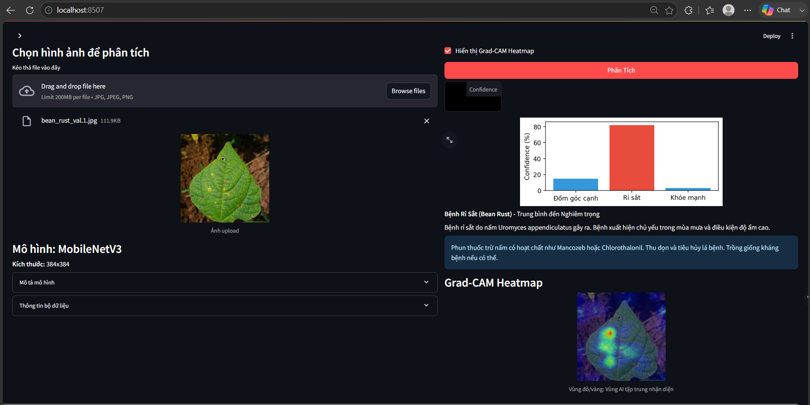

# 🍃 Bean Leaf Lesions Classification & Instance Segmentation

Hệ thống **Deep Learning** toàn diện chẩn đoán, phân loại tổn thương và phân vùng vị trí bệnh hại trên lá đậu (Bean Leaves). Dự án tích hợp các kiến trúc tiên tiến gồm CNN, Vision Transformer (DeiT), Instance Segmentation (YOLOv8-seg) và kiến trúc tự thiết kế **BeanLeafLite** (~0.94M params), đi kèm ứng dụng Web Streamlit.

---

## 📌 Tính năng Hệ thống

- **Hỗ trợ Đa kiến trúc (Multi-Architecture Ecosystem):**
  - **BeanLeafLite (Custom CNN):** Kiến trúc siêu nhẹ tự thiết kế (~0.94M params, Acc **98.50%**).
  - **MobileNetV3-Large:** Tối ưu hóa suy luận thời gian thực cho thiết bị di động / Edge (Acc **97.74%**).
  - **DeiT-Small (Vision Transformer):** Cơ chế Self-Attention cho kết quả chẩn đoán chính xác tuyệt đối (Acc **100.00%**).
  - **EfficientNet-B3:** Cân bằng tối ưu giữa tham số và khả năng tổng quát hóa (Acc **98.50%**).
  - **YOLOv8-seg (Instance Segmentation):** Khoanh vùng và vẽ mặt nạ tổn thương đốm lá thời gian thực.

- **Ứng dụng Web Tương tác (Streamlit Web App):**
  - **Single View:** Phân tích ảnh đơn, hiển thị biểu đồ xác suất & khuyến nghị y tế nông nghiệp.
  - **Compare Mode:** So sánh dự đoán song song của tất cả các mô hình trên cùng một bức ảnh.
  - **Grad-CAM Visualization:** Bản đồ nhiệt giải thích vùng chú ý của AI khi chẩn đoán.

---

## 🛠️ Kiến trúc Tự Thiết Kế: BeanLeafLite (~0.94M Params)

**BeanLeafLite** là mô hình mạng nơ-ron cuộn (CNN) được tự thiết kế nhằm tối ưu hóa sự cân bằng giữa độ chính xác và dung lượng tính toán trên các thiết bị di động hoặc môi trường nhúng:

- **Depthwise-Separable Convolutions:** Tách biệt quá trình lọc không gian (spatial) và phối hợp kênh (channel), giúp giảm số lượng tham số xuống chỉ còn **~0.94M** (nhỏ hơn EfficientNet-B3 gấp 14 lần).
- **Residual Skip Connections:** Kết nối tắt giữa các tầng block giúp dòng gradient truyền trực tiếp, tránh hiện tượng suy giảm gradient khi huấn luyện sâu.
- **Squeeze-and-Excitation (SE) Attention:** Cơ chế chú ý kênh giúp tự động tái trọng số các đặc trưng quan trọng, tập trung vào các chi tiết tổn thương đốm lá nhỏ.
- **Hiệu năng Thực nghiệm:** Đạt **98.50% Test Accuracy** trên tập kiểm thử độc lập, khẳng định hiệu quả vượt trội của mô hình tự thiết kế.

---

## 📊 Tập dữ liệu (Dataset)

- **Bài toán Phân loại (Classification):** [Bean Leaf Lesions Dataset](https://www.kaggle.com/datasets/marquis03/bean-leaf-lesions-classification)
- **Bài toán Phân vùng (Instance Segmentation):** [Roboflow Universe - Bean Leaf Segmentation](https://universe.roboflow.com/alebachew-m/final_instance_segmentation)

**Các lớp bệnh hại (3 Classes):**
1. `angular_leaf_spot` — Bệnh đốm góc lá
2. `bean_rust` — Bệnh gỉ sắt
3. `healthy` — Lá khỏe mạnh

---

## 📈 Kết quả Thực nghiệm & Đánh giá (Benchmark & Evaluation)

### Hiệu năng Mô hình Phân loại (Classification Benchmark)
Đánh giá độc lập trên tập test độc lập (133 ảnh) dưới cùng **Controlled Benchmark Protocol (384px)**:

| Mô hình | Test Accuracy | Tham số (Params) | Phân nhóm Tối ưu & Đặc trưng Kiến trúc |
|---|:---:|:---:|---|
| **DeiT-Small** (ViT) | **100.00%** | ~21.8M | Vision Transformer với cơ chế Self-Attention toàn cục |
| **BeanLeafLite** (Custom CNN) | **98.50%** | **~0.94M** | Depthwise-Separable + Residual + SE Channel Attention (siêu nhẹ) |
| **EfficientNet-B3** | **98.50%** | ~13.0M | Kiến trúc Compound Scaling cân bằng hiệu năng |
| **MobileNetV3-Large** | **97.74%** | ~3.2M | Kiến trúc tối ưu hóa cho thiết bị di động & Edge Computing |

### Hiệu năng Mô hình Phân vùng (YOLOv8 Instance Segmentation)
- **Kiến trúc:** YOLOv8-seg (Instance Segmentation)
- **Tốc độ suy luận (Inference Speed):** **4.9 ms/ảnh** (~200 FPS trên GPU)

---

## 🏗️ Cấu trúc Dự án

```bash
bean-leaf-disease/
├── app/                        # Giao diện Web App Streamlit
│   ├── config.py               # Cấu hình mô hình & thông tin bệnh lý
│   ├── streamlit_app.py        # Ứng dụng chính Streamlit
│   └── utils.py                # Pipeline nạp mô hình, suy luận & Grad-CAM
├── data/                       # Quản lý tập dữ liệu train/val
├── docs/                       # Tài liệu dự án & hình ảnh minh họa
├── models/                     # Thư mục chứa weights (.pth, .pt)
├── outputs/                    # Báo cáo đánh giá định lượng (JSON)
├── scripts/
│   ├── train.py                # Script huấn luyện các mô hình Phân loại
│   ├── train_yolo.py           # Script huấn luyện mô hình Phân vùng (YOLOv8)
│   └── evaluate.py             # Script đánh giá offline & xuất metric
├── src/bean_leaf/              # Core Library Package
│   ├── config.py               # Single Source of Truth cho siêu tham số
│   ├── data/                   # DataLoaders & Augmentations
│   ├── evaluation/             # Đánh giá chỉ số & Grad-CAM
│   ├── models/                 # Kiến trúc mô hình (PyTorch & Ultralytics)
│   └── training/               # Vòng lặp huấn luyện & AMP Mixed Precision
└── tests/                      # Bộ unit tests tự động (pytest)
```

---

## 💻 Triển khai & Sử dụng Web App



```bash
# Cài đặt thư viện & package local
pip install -r requirements.txt
pip install -e .

# Chạy ứng dụng web
streamlit run app/streamlit_app.py
```

---

## 🚀 Huấn luyện & Đánh giá (Training & Evaluation)

### Siêu tham số Huấn luyện Mặc định (`src/bean_leaf/config.py`)
- **Kích thước ảnh (`img_size`):** 384x384
- **Batch size:** 32
- **Tối ưu hóa (`Optimizer`):** AdamW (`lr=3e-4`, `weight_decay=1e-2`)
- **Kỹ thuật:** Automatic Mixed Precision (AMP), Early Stopping (`patience=7`), Label Smoothing (0.05)

### Lệnh Thực thi

```bash
# 1. Huấn luyện toàn bộ các mô hình phân loại (data/train, data/val)
python scripts/train.py --data_dir "./data" --model all

# 2. Huấn luyện mô hình phân vùng YOLOv8 - dataset segmentation (data.yaml) không nằm
#    trong data/ (đó là dataset classification), phải tải riêng từ Roboflow trước:
pip install roboflow
python -c "
from roboflow import Roboflow
rf = Roboflow(api_key='YOUR_ROBOFLOW_API_KEY')
project = rf.workspace('alebachew-m').project('final_instance_segmentation')
dataset = project.version(1).download('yolov8')
print(dataset.location)
"
python scripts/train_yolo.py --data_yaml "<dataset.location>/data.yaml" --epochs 50

# 3. Đánh giá offline 4 model classification và lưu metric ra JSON
python scripts/evaluate.py

# 4. Chạy Unit Tests
pytest -v
```

---

## 👥 Tác giả & Lời cảm ơn

- **Nguyễn Văn Tấn Phát**
- **Nguyễn Hoàng Lộc**

Trân trọng cảm ơn cộng đồng mã nguồn mở **PyTorch**, **Timm**, **Ultralytics**, và **Streamlit** đã hỗ trợ công cụ và nền tảng cho nghiên cứu này.
